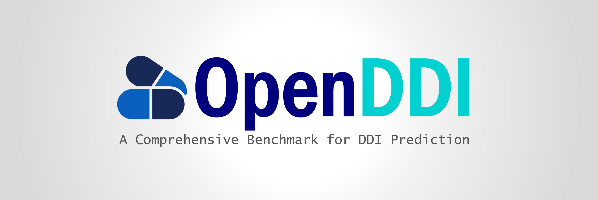

<div align="center">
  
</div>

<p align="center">
  <a href="https://openddi.readthedocs.io/en/latest/">Docs</a> •
  <a href="#quick-start">Quick Start</a> •
  <a href="#references">References</a>
</p>

# OpenDDI

## <span id="quick-start">🚀 Quick Start</span>

Follow these steps to get started with OpenDDI:

### **Step 1: Clone the Repository**

```
git clone <REPO-URL>
cd OpenDDI
```

### **Step 2: Install Dependencies**

#### General Dependencies

You can install the general dependencies:

```
conda env create -f openddi.yml
pip install torch-scatter==2.0.7 torch-sparse==0.6.9 -f https://data.pyg.org/whl/torch-1.7.0+cu110.html
```

### **Step 3: Run the Main Script**

After installing the dependencies, you can run the main script using the following command:

```
python openddi/main.py --model <model_name> --matrix <matrix_name> --modality <modality_name> --epochs <epochs> --batch <batch>
```

#### Optional arguments:

- `--model <model_name>`: Model choice, e.g., `MRCGNN`, `GOGNN`, `ZeroDDI`, `TIGER`, `MVA`, `MUFFIN`, `CASTER`, `MMDGDTI`, `MKGFENN`, etc.
- `--matrix <matrix_name>`: Interaction matrix, e.g., `binary`, `ChCh-Miner`, `Ryus`, `Dengs`, `zeroddi`, `multilabel`, `twosides`, etc.
- `--modality <modality_name>`: Modality types, e.g., `smiles`, `sequence`, `3d`, `mechanism`, `text`, `drkg`, etc. (can specify multiple)
- `--epochs <epochs>`: Number of epochs to run.
- `--batch <batch>`: The batch size to use.

Note that the above list includes only a subset of the available parameters. For more parameters and their descriptions, please refer to the `openddi/parms_setting.py` file.

### Example Command:

To run the **MRCGNN** model on the **Ryus** DDI dataset with **smiles sequence 3d mechanism text** modalities, you can run the following command:

```
python openddi/main.py --model MRCGNN --matrix Ryus --modality smiles sequence 3d mechanism text --epochs 100 --batch 4096
```

This command will:

- Use the **MRCGNN** model
- Use the **Ryus** dataset
- Use the **smiles sequence 3d mechanism text** modalities
- Train for **100 epochs** with a **batch size of 4096**

## <span id="references">📖 References</span>

| ID   | **Algorithm** | **Paper**                                                    | **Conference/Journal**           | Year |
| :--- | :------------ | :----------------------------------------------------------- | :------------------------------- | :--- |
| 1    | DeepDDI       | *Deep learning improves prediction of drug–drug and drug–food interactions* | PNAS                             | 2018 |
| 2    | DDIMDL        | *A multimodal deep learning framework for predicting drug–drug interaction events* | Bioinformatics                   | 2020 |
| 3    | CASTER        | *CASTER: Predicting Drug Interactions with Chemical Substructure Representation* | AAAI                             | 2020 |
| 4    | DDKG          | *Attention-based Knowledge Graph Representation Learning for Predicting Drug-drug Interactions* | Briefings in Bioinformatics      | 2022 |
| 5    | KGNN          | *KGNN: knowledge graph neural network for drug-drug interaction prediction* | IJCAI                            | 2020 |
| 6    | LaGAT         | *LaGAT: link-aware graph attention network for drug–drug interaction prediction* | Bioinformatics                   | 2022 |
| 7    | ExDDI         | *ExDDI: explaining drug-drug interaction predictions with natural language* | AAAI                             | 2025 |
| 8    | GoGNN         | *GoGNN: graph of graphs neural network for predicting structured entity interactions* | IJCAI                            | 2020 |
| 9    | MIRACLE       | *Multi-view Graph Contrastive Representation Learning for Drug-Drug Interaction Prediction* | WWW                              | 2021 |
| 10   | TIGER         | *Dual-Channel Learning Framework for Drug-Drug Interaction Prediction via Relation-Aware Heterogeneous Graph Transformer* | AAAI                             | 2024 |
| 11   | SumGNN        | *SumGNN: multi-typed drug interaction prediction via efficient knowledge graph summarization* | Bioinformatics                   | 2021 |
| 12   | PHGLDDI       | *PHGL-DDI: A pre-training based hierarchical graph learning framework for drug-drug interaction prediction* | Expert Systems with Applications | 2025 |
| 13   | MRCGNN        | *Multi-Relational Contrastive Learning Graph Neural Network for Drug-Drug Interaction Event Prediction* | AAAI                             | 2023 |
| 14   | DSN-DDI       | *DSN-DDI: an accurate and generalized framework for drug--drug interaction prediction by dual-view representation learning* | Briefings in Bioinformatics      | 2023 |
| 15   | ConvLSTM      | *Drug-Drug Interaction Prediction Based on Knowledge Graph Embeddings and Convolutional-LSTM Network* | BCB                              | 2019 |
| 16   | MUFFIN        | *MUFFIN: multi-scale feature fusion for drug–drug interaction prediction* | Bioinformatics                   | 2021 |
| 17   | MVA-DDI       | *Interpretable multi-view attention network for drug-drug interaction prediction* | IEEE BIBM                        | 2023 |
| 18   | MKGFENN       | *MKG-FENN: A Multimodal Knowledge Graph Fused End-to-End Neural Network for Accurate Drug–Drug Interaction Prediction* | AAAI                             | 2024 |
| 19   | MMDGDTI       | *MMDG-DTI: Drug–target interaction prediction via multimodal feature fusion and domain generalization* | Pattern Recognition              | 2025 |
| 20   | ZeroDDI       | *ZeroDDI: a zero-shot drug-drug interaction event prediction method with semantic enhanced learning and dual-modal uniform alignment* | IJCAI                            | 2024 |